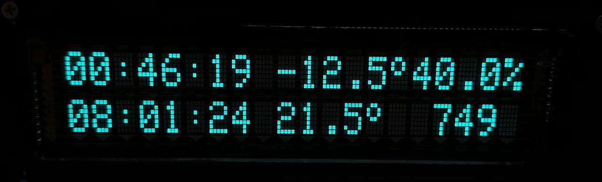

# GClock

### Overview
Clock:  
   * display: vacuum fluorescent display datecs, 20x2 characters are provided with a 5 x 7 dot matrix  
   * GPS: UBlox NEO-6M  
   * outdor temperature sensor: DS18B20  
   * outdor temperature sensor: DS18B20  
   * HDC1080 humidity sensor  
   * BME280 humidity and pressure sensor  

### Requirements
toolchain arm-none-eabi 10.3 or higher  
gcc / g++ 7.5.0 or higher  
cmake 3.14 or higher  
libjsoncpp-dev  

### Build project
>mkdir build  
>cd build  
>cmake .. -G "Unix Makefiles" -DCMAKE_TOOLCHAIN_FILE=../toolchain.cmake  
>make -j8  

#### Start debug server
>./scripts/gdb-serv.sh openocd-jlink

#### Start debug client
>./scripts/gdb-client.sh
